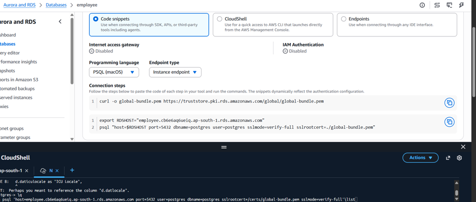
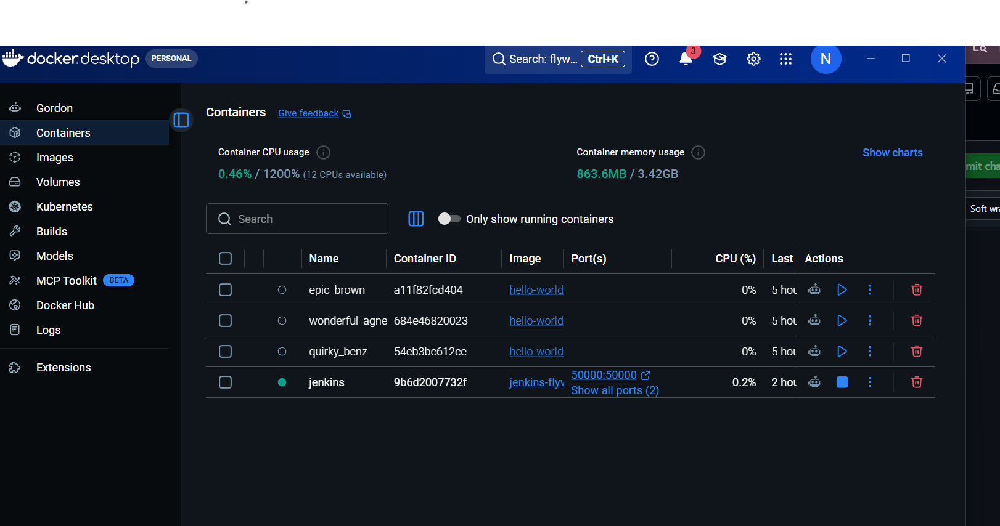
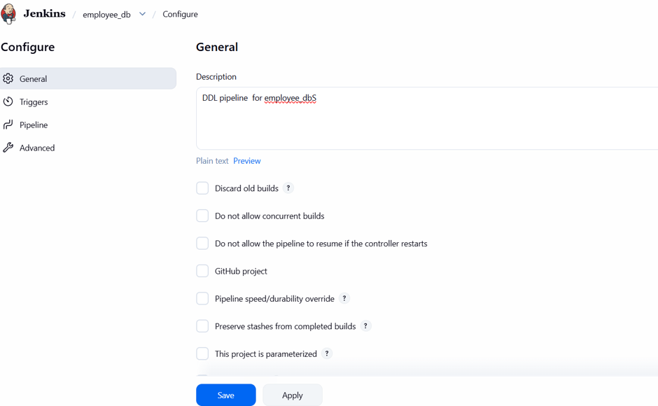
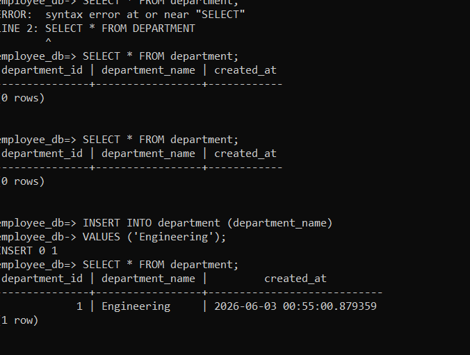

# PART 1
# Database CI/CD Pipeline using Jenkins, Flyway, Docker, and AWS PostgreSQL

## Project Overview

This project demonstrates an end-to-end Database CI/CD pipeline for PostgreSQL schema deployments using GitHub, Jenkins, Flyway, Docker, and AWS RDS.

The objective was to automate database schema changes (DDL deployment) through version-controlled migration scripts and CI/CD workflows.

---

## Architecture

```text
Developer
   ↓
GitHub Repository
   ↓
Jenkins Pipeline (Docker)
   ↓
Flyway
   ↓
AWS RDS PostgreSQL
```

---

## Technology Stack

* PostgreSQL (AWS RDS)
* Flyway
* Jenkins
* Docker Desktop
* GitHub
* pgAdmin

---

## Repository Structure

```text
employee-db-platform/

├── sql/
│   ├── V1__create_department_table.sql
│   ├── V2__create_employee_table.sql
│   
│
├── config/
│
├── docs/
│
├── Jenkinsfile
│
└── README.md
```

---

## Implementation Steps

### Step 1: Create Git Repository

Created a GitHub repository to store database migration scripts.

Migration naming convention followed Flyway standards:

```text
V1__create_department_table.sql
V2__create_employee_table.sql
```

Feature branches were used for development and changes were merged into the main branch through Pull Requests.

---

### Step 2: Create AWS PostgreSQL Database

Created an AWS RDS PostgreSQL instance.

Configuration:

* Engine: PostgreSQL
* Database Name: employee_db
* Public Access: Enabled
* Security Group configured to allow local machine access on port 5432

Verified connectivity using pgAdmin.

---


### Step 3: Setup Docker Desktop

Installed Docker Desktop on Windows.

Instead of installing Jenkins directly on Windows, Jenkins was deployed as a Docker container.

Benefits:

* Faster setup
* Isolated environment
* Easy upgrade and maintenance
* Reproducible deployment

---

### Step 4: Jenkins Setup using Docker

Pulled Jenkins image:

```text
jenkins/jenkins:lts
```

Used Docker Desktop UI to:

* Pull Jenkins image
* Create Jenkins container
* Expose port 8080
* Configure persistent volume

Jenkins became available at:


```text

http://localhost:9090
```


Installed recommended plugins during initial setup.

---

### Step 5: GitHub Integration

Created a Jenkins Pipeline Job.

Configured:

* Pipeline Script from SCM
* Git Repository URL
* Main Branch

Initial pipeline was created to verify Jenkins could clone and execute repository code successfully.

---

### Step 6: Flyway Integration

Flyway was used to manage schema migrations.

Responsibilities:

* Track migration history
* Apply DDL changes
* Prevent duplicate deployments
* Maintain schema versioning

Flyway creates and manages:

```sql
flyway_schema_history
```

table automatically.



---

### Step 7: Secure Credential Management

Database credentials were not stored in GitHub.

Instead, Jenkins Credentials Manager was used.

Created:

Credential Type:

* Username with Password

Configuration:

```text
ID: postgress-dev
Username: postgres
Password: ********
```

Pipeline accessed credentials using:

```groovy
withCredentials([
    usernamePassword(
        credentialsId: 'postgres-dev',
        usernameVariable: 'DB_USER',
        passwordVariable: 'DB_PASSWORD'
    )
])
```

Benefits:

* Passwords hidden from source code
* Secure execution
* Production-ready approach

---

### Step 8: Migration Deployment

Pipeline execution flow:

```text
GitHub
   ↓
Jenkins
   ↓
Flyway Validate
   ↓
Flyway Migrate
   ↓
AWS PostgreSQL
```

When migrations are merged into main:

1. Jenkins pulls latest code.
2. Flyway validates migration sequence.
3. Flyway applies pending migrations.
4. Schema changes are deployed automatically.

---

## Debugging and Challenges Faced

### Challenge 1: Determining Deployment Target

Issue:

Initially there was confusion about where table creation would occur.

Resolution:

Learned that Flyway determines deployment target using database connection configuration and not from SQL scripts.

---

### Challenge 2: Jenkins Installation Choice

Issue:

Whether to install Jenkins directly on Windows or use Docker.

Resolution:

Chose Docker-based Jenkins deployment because it is simpler to manage and closer to modern DevOps practices.

---

### Challenge 3: Flyway Command Not Found

Issue:

Jenkins pipeline failed because Flyway executable was not available in Jenkins runtime.

Error:

```text
flyway: command not found
```

Resolution:

Verified Flyway installation strategy and ensured Flyway was accessible from Jenkins execution environment.

---

### Challenge 4: Secure Credential Storage

Issue:

Database endpoint and password should not be committed to GitHub.

Resolution:

Used Jenkins Credentials Store instead of storing credentials in configuration files.

---

### Challenge 5: RDS Connectivity

Issue:

Required external access from local environment.

Resolution:

Configured AWS Security Group rules and validated connectivity using pgAdmin before integrating Jenkins.

---

## Validation

Verified successful deployment by checking:

```sql
SELECT *
FROM flyway_schema_history;
```

Verified table creation:

```sql
SELECT table_name
FROM information_schema.tables
WHERE table_schema='public';
```

Expected output:

* department
* employee
* salary
* flyway_schema_history

---

## Outcome

Successfully built an automated Database CI/CD pipeline capable of:

* Version controlling DDL changes
* Automated schema deployments
* Secure credential management
* AWS-hosted PostgreSQL deployments
* Migration tracking and auditing
* Jenkins-based CI/CD automation

---

## Future Enhancements

* Multi-environment deployment (Dev, QA, Prod)
* Automatic deployment triggers on merge
* Dockerized Flyway execution
* FastAPI service for CRUD operations
* Database rollback strategy
* AWS Secrets Manager integration
* Infrastructure as Code using Terraform
* Monitoring and alerting
